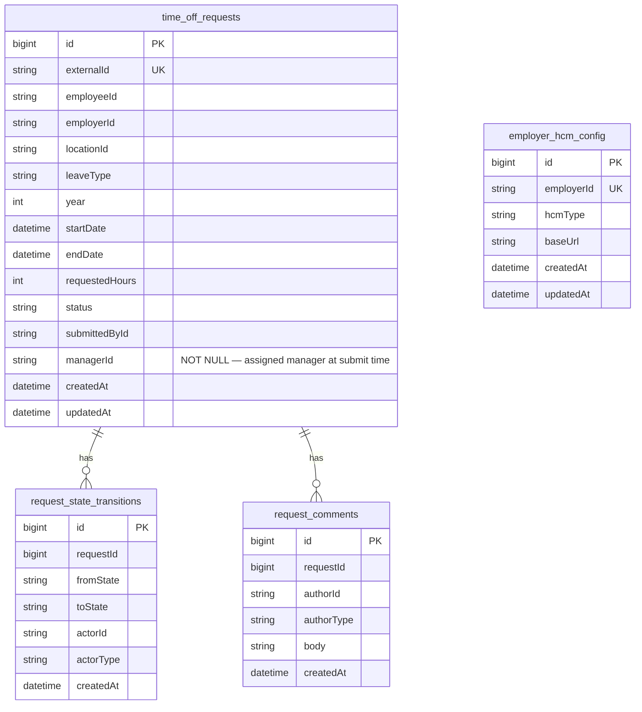
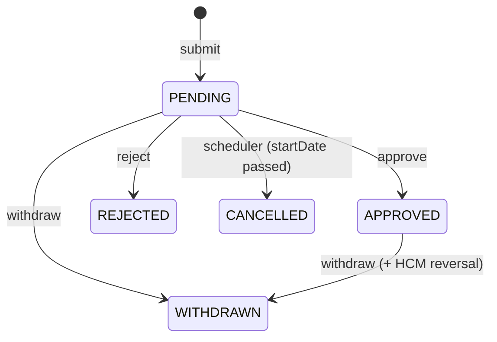
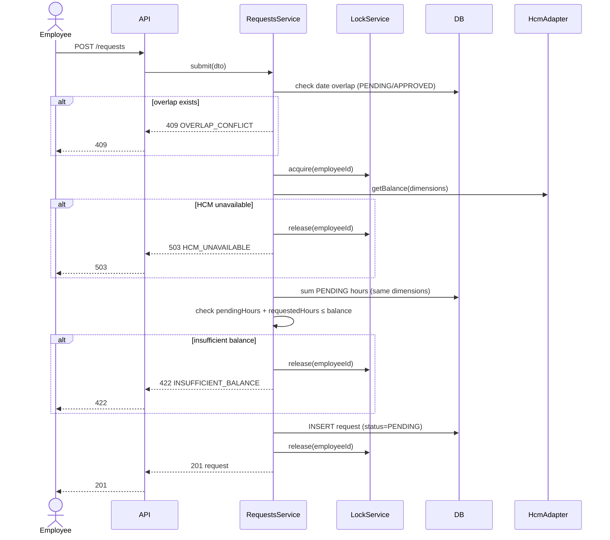
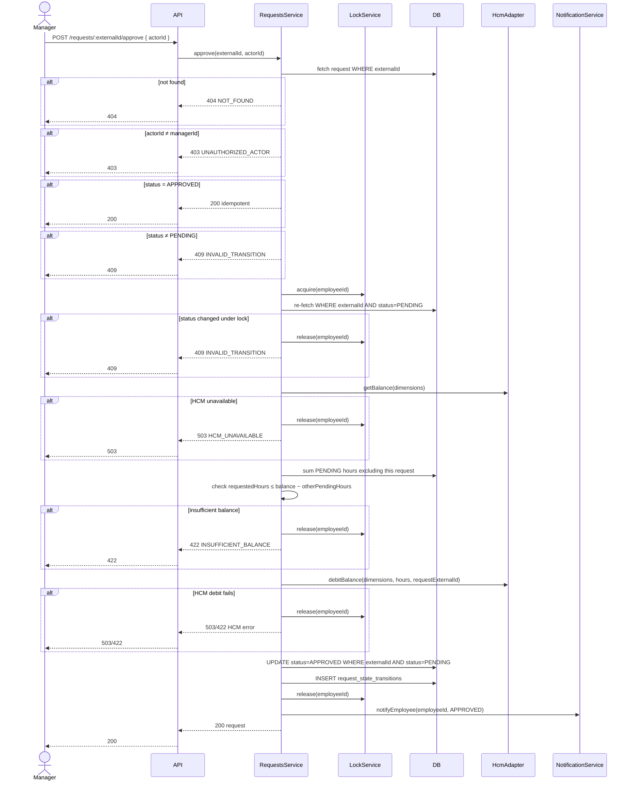
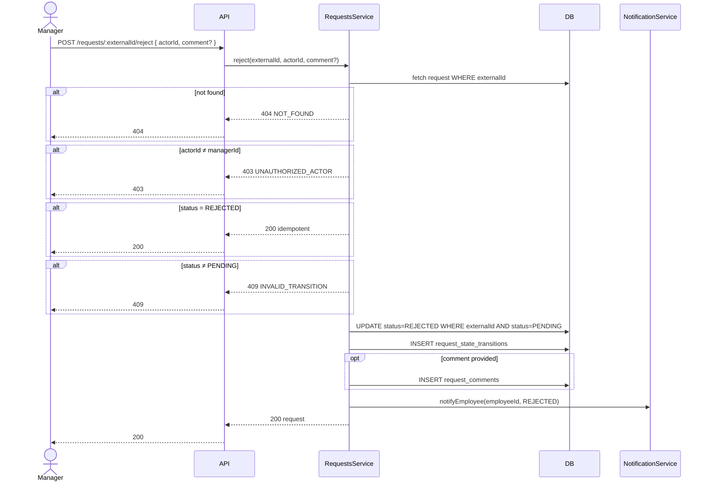
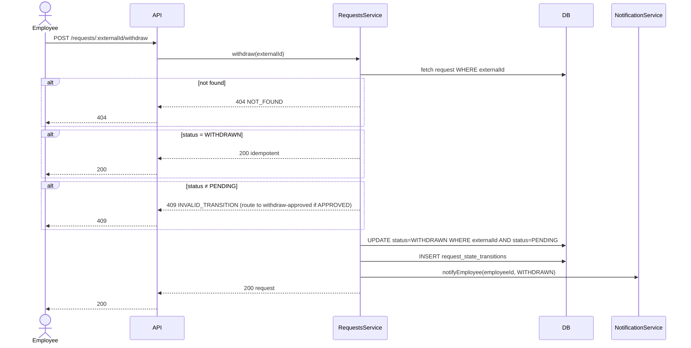
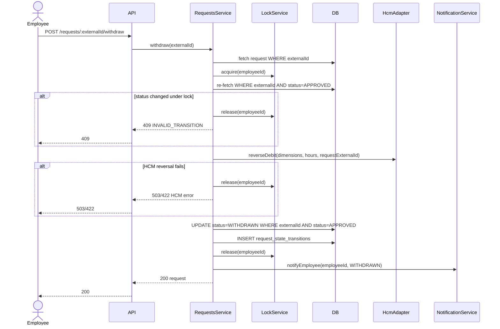
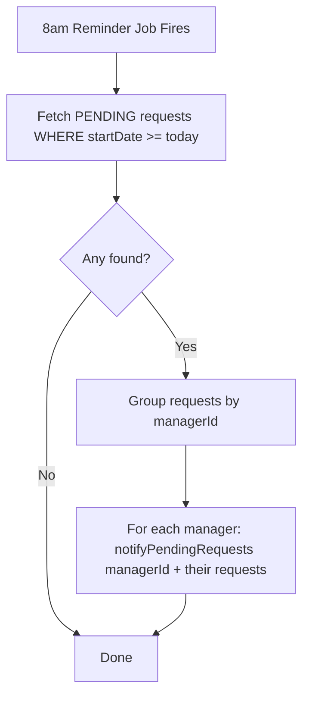
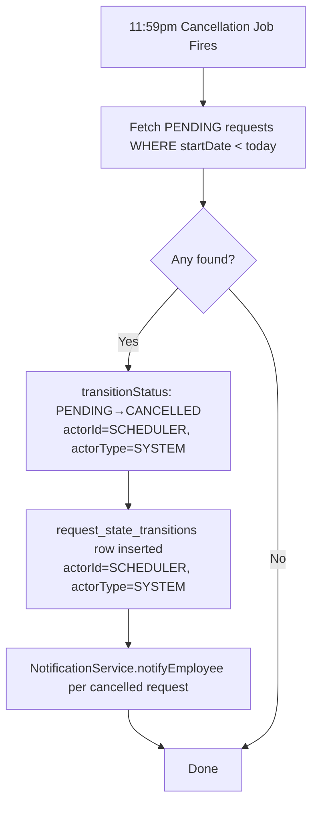

<a id="top"></a>

# Time-Off Microservice — Technical Requirements Document

> Related: [Architecture Decision Record](ADR.md) · [Test Plan](./TEST-PLAN.md)

---

## Contents

1. [Overview](#1-overview)
2. [Goals](#2-goals)
3. [Functional Requirements](#3-functional-requirements)
4. [Non-Functional Requirements](#4-non-functional-requirements)
5. [Proposed Solution](#5-proposed-solution)
6. [Architecture](#6-architecture)
   - [Module Layout](#module-layout)
   - [Component Responsibilities](#component-responsibilities)
   - [Cross-Cutting Concerns](#cross-cutting-concerns)
   - [HCM Adapter Interface](#hcm-adapter-interface)
   - [System Diagram](#system-diagram)
7. [Database Schema](#7-database-schema)
   - [Enum Values](#enum-values)
   - [Access Patterns and Indexes](#access-patterns-and-indexes)
   - [Transactions and Concurrency](#transactions-and-concurrency)
   - [Migrations](#migrations)
   - [Data Lifecycle](#data-lifecycle)
8. [APIs](#8-apis)
    - [GET /requests](#get-requests--list-and-filter-requests)
    - [POST /requests](#post-requests--submit-a-request)
    - [GET /requests/:externalId](#get-requestsexternalid--fetch-a-request)
    - [POST /requests/:externalId/approve](#post-requestsexternalidapprove--approve-a-request)
    - [POST /requests/:externalId/reject](#post-requestsexternalidreject--reject-a-request)
    - [POST /requests/:externalId/withdraw](#post-requestsexternalidwithdraw--withdraw-a-request)
    - [PATCH /requests/:externalId/manager](#patch-requestsexternalidmanager--re-assign-manager)
    - [POST /requests/:externalId/comments](#post-requestsexternalidcomments--add-a-comment)
    - [GET /requests/:externalId/comments](#get-requestsexternalidcomments--fetch-comments)
    - [GET /employees/:employeeId/balance](#get-employeesemployeeidbalance--get-current-balance)
    - [HCM Adapter (Internal Contract)](#hcm-adapter-internal-contract)
9. [Workflows](#9-workflows)
    - [State Machine](#state-machine)
    - [Submit Request](#submit-request)
    - [Approve Request](#approve-request)
    - [Reject Request](#reject-request)
    - [Withdraw Request (PENDING)](#withdraw-request-pending)
    - [Withdraw Request (APPROVED)](#withdraw-request-approved)
    - [Daily Scheduler — 8am Reminder Job](#daily-scheduler--8am-reminder-job)
    - [Daily Scheduler — 11:59pm Cancellation Job](#daily-scheduler--1159pm-cancellation-job)
10. [Testing](#10-testing)
11. [Folder Structure](#11-folder-structure)
12. [Dependencies](#12-dependencies)
13. [Acceptance Criteria](#13-acceptance-criteria)

---

## 1. Overview

The Time-Off Microservice manages the full lifecycle of employee time-off requests for ReadyOn. It is the system of record for request state, but deliberately not the system of record for leave balances — that authority remains with each employer's Human Capital Management (HCM) system. The core technical tension is maintaining balance integrity across two independently mutable systems: ReadyOn records requests, HCM owns balances, and neither fully controls the other.

The service is multi-employer: each employer may use a different HCM system (Workday, SAP, others). It is an internal service — all authentication is handled at the internal gateway layer via client-id and api-key headers. No user-level auth logic exists within this service.

<div align="right"><a href="#top">↑ top</a></div>

---

## 2. Goals

- Manage the complete time-off request lifecycle: submit, approve, reject, withdraw, and auto-cancel
- Enforce balance integrity by reading and debiting HCM in real time on every approval
- Support multiple employers, each with a potentially different HCM system
- Defend against external balance mutations — HCM balances can change outside of ReadyOn at any time
- Defend against unreliable HCM error signaling — ReadyOn enforces its own balance guards regardless of whether HCM returns an error
- Notify managers daily of pending requests and auto-cancel requests that were not actioned before their start date
- Provide comment threads on requests for both employees and managers
- Return structured, actionable error responses for all failure modes

<div align="right"><a href="#top">↑ top</a></div>

---

## 3. Functional Requirements

- **FR-1:** An employee can submit a time-off request specifying `employeeId`, `employerId`, `locationId`, `leaveType`, `year`, `startDate`, `endDate`, `requestedHours`, and `managerId`. `startDate` and `endDate` must be ISO 8601 date strings (`YYYY-MM-DD`) for full-day requests, or ISO 8601 datetime strings for partial-day requests; when a time component is present, it must fall on a 15-minute boundary (`:00`, `:15`, `:30`, or `:45`) with zero seconds.
- **FR-2:** A submitted request must be rejected if it overlaps in date range with an existing PENDING or APPROVED request for the same employee, leave type, and year.
- **FR-3:** A submitted request must be rejected if the requested hours exceed the employee's available leave balance.
- **FR-4:** A manager can approve a PENDING request; the employee's leave balance must be debited on approval.
- **FR-5:** A manager can reject a PENDING request with an optional comment.
- **FR-6:** An employee can withdraw a PENDING request.
- **FR-7:** An employee can withdraw an APPROVED request; the employee's leave balance must be restored on withdrawal.
- **FR-10:** An employee or manager can add a comment to any request.
- **FR-11:** Comments on a request can be retrieved.
- **FR-12:** The current leave balance for an employee can be retrieved from the HCM system.
- **FR-13:** Managers must be notified daily of PENDING requests assigned to them. PENDING requests that have passed their start date without a manager decision must be automatically cancelled, and the affected employee must be notified.
- **FR-14:** All request state transitions must be recorded with the actor, previous state, and timestamp.
- **FR-15:** The employee must be notified on every terminal or manager-actioned state transition: `APPROVED`, `REJECTED`, `WITHDRAWN`, and `CANCELLED`.

<div align="right"><a href="#top">↑ top</a></div>

---

## 4. Non-Functional Requirements

- **Correctness:** Concurrent approvals for the same employee must never result in over-approval. A request must not reach an approved state unless the corresponding balance debit succeeded.
- **Reliability:** All failures must produce structured, actionable error responses. Infrastructure failures and domain validation failures must be distinguishable by the caller.
- **Idempotency:** Re-submitting an approve or reject on a request that has already been transitioned must be safe and produce no additional side effects.
- **Observability:** All interactions with external systems, all state transitions, all scheduled job runs, and all errors must be observable through the service's instrumentation.
- **Scalability:** v1 targets single-instance deployment. Horizontal scaling is out of scope for v1.
- **Security:** The service is internal. Authentication is enforced at the API gateway layer. No per-user or per-employee credentials are stored by the service.
- **Scheduler reliability:** A missed scheduler run must not result in permanently un-cancelled requests. The cancellation condition must be re-evaluated on every subsequent run.

<div align="right"><a href="#top">↑ top</a></div>

---

## 5. Proposed Solution

The Time-Off Microservice is a NestJS/TypeScript service that manages the full lifecycle of employee time-off requests. It is the system of record for request state, but deliberately not the system of record for leave balances — that authority remains with the employer's HCM system. Every balance read and debit flows through the HCM adapter layer in real time; ReadyOn never stores a balance locally.

The service is multi-employer by design. Each employer has a distinct HCM system (Workday, SAP, or otherwise), and the `HcmAdapterFactory` resolves the correct adapter at runtime by looking up the employer's configuration from `employer_hcm_config`. All HCM adapter implementations share a common interface (`getBalance`, `debitBalance`, `reverseDebit`), so the rest of the service is HCM-agnostic. Authentication with HCM uses ReadyOn's own service-level credentials — no per-user credentials are stored.

When an employee submits a request, the service acquires a per-employee in-process lock, reads the current balance live from HCM, sums the employee's existing PENDING hours from the local DB for the same balance dimensions, and checks that the new request fits within the remaining balance. If it does, the request is inserted as PENDING and the lock is released. Note: SQLite does not support row-level locking — the in-process lock is the sole concurrency guard in v1; this is a known constraint if the service is ever scaled beyond a single instance. In production, this service should be backed by an RDBMS that supports row-level locking (e.g., PostgreSQL), which would replace the in-process lock with a database-level `SELECT ... FOR UPDATE` per employee. When a manager approves, the lock is re-acquired, the balance is re-read from HCM (defending against any changes since submit time), the debit is posted to HCM, and only on success is the DB record updated to APPROVED. If the HCM debit fails for any reason — infrastructure error or domain error — the DB remains PENDING, the lock is released, and a structured error is returned to the caller. Reject and withdraw-PENDING are local-only state transitions with no HCM involvement. Withdraw-APPROVED posts a reversal to HCM before transitioning state.

Two daily scheduler jobs run independently via `@nestjs/schedule`. The 8am reminder job notifies managers of all PENDING requests where `startDate >= today`, giving them the full day to act. The 11:59pm cancellation job scans for PENDING requests where `today > startDate`, marks them `CANCELLED` (recording `actorId='SCHEDULER'`, `actorType=SYSTEM` in the transition row), and notifies each affected employee. The time separation is intentional — managers receive the morning reminder before any cancellations fire. The `NotificationService` also fires an employee notification on every terminal or manager-actioned state transition: `APPROVED`, `REJECTED`, `WITHDRAWN`, and `CANCELLED`. The `NotificationService` interface is designed for future SNS integration — v1 logs the event. Comments are append-only records attached to a request, writable by both employees and managers, always optional, and returned as part of the request detail response.

<div align="right"><a href="#top">↑ top</a></div>

---

## 6. Architecture

### Module Layout

```
AppModule
├── RequestsModule       — request lifecycle, per-employee lock
├── BalanceModule        — real-time balance pass-through from HCM
├── CommentsModule       — append-only comment threads
├── SchedulerModule      — daily cancellation + manager notification job
├── NotificationsModule  — NotificationService stub (SNS-ready)
├── HcmModule            — adapter factory + per-employer adapter resolution
├── DatabaseModule       — TypeORM + SQLite, migrations
└── CommonModule         — ClockService, UuidService, exception filter
```

### Component Responsibilities

| Component | Owns |
|---|---|
| `RequestsController` | HTTP boundary for all request lifecycle endpoints including list and re-assignment |
| `RequestsService` | State machine, balance guard, lock orchestration, HCM debit sequence, managerId enforcement on approve/reject |
| `RequestsRepository` | All DB reads/writes for `time_off_requests`, `request_state_transitions`; owns the filtered list query |
| `LockService` | Per-employee in-process mutex |
| `BalanceController` | HTTP boundary for balance endpoint |
| `BalanceService` | HCM pass-through for balance reads |
| `CommentsController` | HTTP boundary for comment endpoints |
| `CommentsService` | Comment creation and retrieval |
| `SchedulerService` | Two daily cron jobs: 8am reminder (group PENDING requests by `managerId`, notify each manager of their team's requests); 11:59pm cancellation (cancel expired PENDING requests, notify employees) |
| `NotificationService` | Stub interface — logs in v1, SNS-ready |
| `HcmAdapterFactory` | Resolves correct `IHcmAdapter` per `employerId` at runtime |
| `WorkdayAdapter`, `SapAdapter` | HCM-specific implementations of `IHcmAdapter` |
| `ClockService` | Injectable wrapper around `Date.now()` — enables time-freezing in tests |
| `UuidService` | Injectable wrapper around UUID generation — enables deterministic UUIDs in tests |
| `HttpExceptionFilter` | Formats all errors to `{ code, message }` shape |

### Cross-Cutting Concerns

- **Auth:** Handled entirely at the internal gateway. The service trusts all inbound requests. No guard or middleware for auth.
- **Validation:** NestJS `ValidationPipe` with `class-validator` + `class-transformer` on all DTOs. All external input validated at the controller boundary.
- **Error handling:** `HttpExceptionFilter` catches all exceptions and returns `{ code: string, message: string }`. HTTP status codes are first-class contract.
- **Logging:** Structured JSON logging on all HCM calls (employer, type, latency, status), all state transitions (requestId, from, to, actor), and all scheduler runs (counts cancelled, counts notified).

### HCM Adapter Interface

```typescript
interface IHcmAdapter {
  getBalance(params: BalanceKey): Promise<number>;
  debitBalance(params: BalanceKey & { hours: number; requestExternalId: string }): Promise<void>;
  reverseDebit(params: BalanceKey & { hours: number; requestExternalId: string }): Promise<void>;
}

type BalanceKey = {
  employerId: string;
  employeeId: string;
  locationId: string;
  leaveType: LeaveType;
  year: number;
};
```

All HCM calls use a 5-second timeout with no retries (fail fast). Infrastructure failures surface as `HCM_UNAVAILABLE` (503); domain errors (insufficient balance, invalid dimensions) surface as `HCM_ERROR` (422).

### System Diagram

```mermaid
flowchart TD
    Client([Internal Service / Gateway])
    GW[Internal Gateway\nclient-id + api-key]
    RC[RequestsController]
    RS[RequestsService]
    LS[LockService]
    RR[RequestsRepository]
    BC[BalanceController]
    BS[BalanceService]
    CC[CommentsController]
    CS[CommentsService]
    SCH[SchedulerService\n@Cron 8am daily]
    NS[NotificationService\nstub / SNS-ready]
    FAC[HcmAdapterFactory]
    WD[WorkdayAdapter]
    SAP[SapAdapter]
    DB[(SQLite DB)]
    HCM_W([Workday HCM])
    HCM_S([SAP HCM])

    Client --> GW --> RC & BC & CC
    RC --> RS
    RS --> LS
    RS --> RR --> DB
    RS --> FAC
    BS --> FAC
    FAC --> WD & SAP
    WD --> HCM_W
    SAP --> HCM_S
    BC --> BS
    CC --> CS --> DB
    SCH --> RR
    SCH --> NS
```

<div align="right"><a href="#top">↑ top</a></div>

---

## 7. Database Schema



### Enum Values

| Field | Values |
|---|---|
| `leaveType` | `VACATION`, `SICK` |
| `status` | `PENDING`, `APPROVED`, `REJECTED`, `WITHDRAWN`, `CANCELLED` |
| `actorType` | `EMPLOYEE`, `MANAGER`, `SYSTEM` |
| `authorType` | `EMPLOYEE`, `MANAGER` |
| `hcmType` | `WORKDAY`, `SAP` |

### Access Patterns and Indexes

| Access Pattern | Index |
|---|---|
| Fetch request by `externalId` | `UNIQUE (externalId)` on `time_off_requests` |
| Fetch all requests for an employee | `(employeeId)` on `time_off_requests` |
| Fetch all requests for an employer | `(employerId)` on `time_off_requests` |
| Fetch all requests for a location | `(locationId)` on `time_off_requests` |
| Check date overlap on submit | Composite `(employeeId, employerId, locationId, leaveType, year, status)` narrows to the employee's active requests; `(startDate)` and `(endDate)` individual indexes support the range conditions `startDate <= :endDate` and `endDate >= :startDate` |
| Sum PENDING hours on submit/approve | Same composite index |
| Scheduler: find PENDING requests past `startDate` | Composite `(status, startDate)` on `time_off_requests` |
| Scheduler: find PENDING requests for reminders | Same composite index |
| Manager's pending queue (`GET /requests?managerId=`) | Composite `(managerId, status)` on `time_off_requests` |
| Employee's request history (`GET /requests?employeeId=`) | Composite `(employeeId, status)` on `time_off_requests` |
| Fetch state transitions for a request | `(requestId)` on `request_state_transitions` |
| Fetch comments for a request | `(requestId)` on `request_comments` |
| Resolve HCM adapter for employer | `UNIQUE (employerId)` on `employer_hcm_config` |

No foreign key constraints. All relationships are application-enforced; indexes are for query performance only.

### Transactions and Concurrency

Every state transition (approve, reject, withdraw, cancel) wraps its DB writes in a single transaction. The transactional boundary is:

1. `UPDATE time_off_requests SET status = ? WHERE externalId = ? AND status = ?`
2. `INSERT INTO request_state_transitions ...`

The `WHERE status = ?` condition is the optimistic concurrency guard — if another operation has already transitioned the record, the update affects zero rows and the operation returns the appropriate idempotent response or conflict error.

HCM calls happen **outside** the transaction. The DB write commits only after a successful HCM response. This ensures the DB never reaches `APPROVED` unless HCM has been debited.

The per-employee in-process lock (`LockService`) wraps the full sequence: lock → HCM read → DB check → HCM write → DB write → unlock. This prevents C-1 (concurrent approvals racing on the same balance).

### Migrations

TypeORM migrations via `typeorm migration:generate` and `typeorm migration:run`. Migration files live in `src/database/migrations/`. All schema changes are applied via migration — no `synchronize: true` in production.

### Data Lifecycle

All records are retained indefinitely in v1. No archival or deletion policy is defined.

<div align="right"><a href="#top">↑ top</a></div>

---

## 8. APIs

All endpoints return errors as `{ code: string, message: string }`. HTTP status codes are first-class contract.

### Requests

#### GET /requests — List and filter requests

**Purpose:** Query requests by manager or employee. Required for manager dashboards and employee history views.

**Query params:**

| Param | Type | Required | Notes |
|---|---|---|---|
| `managerId` | string | one of `managerId` or `employeeId` required | Returns requests assigned to this manager |
| `employeeId` | string | one of `managerId` or `employeeId` required | Returns requests submitted by this employee |
| `status` | string (enum) | optional | Filter by request status |
| `limit` | integer | optional, default 20, max 100 | Pagination page size |
| `offset` | integer | optional, default 0 | Pagination offset |

**Response:** `200 OK`
```json
{
  "items": [
    {
      "externalId": "string",
      "employeeId": "string",
      "employerId": "string",
      "locationId": "string",
      "leaveType": "string",
      "year": "integer",
      "startDate": "datetime",
      "endDate": "datetime",
      "requestedHours": "integer",
      "status": "string",
      "managerId": "string",
      "submittedById": "string",
      "createdAt": "datetime",
      "updatedAt": "datetime"
    }
  ],
  "total": "integer",
  "limit": "integer",
  "offset": "integer"
}
```

**Error cases:** `VALIDATION_ERROR` (400) if `managerId` or `employeeId` is blank or both are provided simultaneously.

**Notes:** Response does not include the `transitions` array — use `GET /requests/:externalId` for the full audit trail.

---

#### POST /requests — Submit a request

**Purpose:** Submit a new time-off request.

**Request body:**
```json
{
  "employeeId": "string, required",
  "employerId": "string, required",
  "locationId": "string, required",
  "leaveType": "VACATION | SICK, required",
  "year": "integer, required",
  "startDate": "ISO 8601 date (YYYY-MM-DD) or datetime; if datetime, time must be on a 15-minute boundary (HH:MM must be :00, :15, :30, or :45; seconds must be 00)",
  "endDate": "ISO 8601 date or datetime, required, >= startDate; same 15-minute boundary rule applies when time is present",
  "requestedHours": "integer > 0, required",
  "submittedById": "string, required",
  "managerId": "string, required — ID of the employee's direct manager"
}
```

**Response:** `201 Created`
```json
{
  "externalId": "string (UUID)",
  "status": "PENDING",
  "createdAt": "datetime"
}
```

**Error cases:**
| Code | HTTP | Condition |
|---|---|---|
| `OVERLAP_CONFLICT` | 409 | Overlapping PENDING or APPROVED request exists |
| `INSUFFICIENT_BALANCE` | 422 | Requested hours exceed available balance |
| `HCM_UNAVAILABLE` | 503 | HCM call failed (infrastructure error) |
| `HCM_ERROR` | 422 | HCM returned a domain error |
| `HCM_CONFIG_NOT_FOUND` | 422 | No HCM config found for employer |

**Idempotency:** Not idempotent — each call creates a new request.

---

#### GET /requests/:externalId — Fetch a request

**Purpose:** Retrieve a request with its full state transition history.

**Response:** `200 OK`
```json
{
  "externalId": "string",
  "employeeId": "string",
  "employerId": "string",
  "locationId": "string",
  "leaveType": "string",
  "year": "integer",
  "startDate": "date",
  "endDate": "date",
  "requestedHours": "integer",
  "status": "string",
  "submittedById": "string",
  "createdAt": "datetime",
  "updatedAt": "datetime",
  "transitions": [
    {
      "fromState": "string",
      "toState": "string",
      "actorId": "string",
      "actorType": "string",
      "createdAt": "datetime"
    }
  ]
}
```

**Error cases:** `NOT_FOUND` (404)

---

#### POST /requests/:externalId/approve — Approve a request

**Purpose:** Approve a PENDING request. Re-validates balance against HCM and debits on success.

**Request body:** *(empty — actor context passed via trusted headers from gateway)*

**Response:** `200 OK` — full request object (same shape as GET)

**Error cases:**
| Code | HTTP | Condition |
|---|---|---|
| `NOT_FOUND` | 404 | Request not found |
| `UNAUTHORIZED_ACTOR` | 403 | `actorId` does not match the request's `managerId` |
| `INVALID_TRANSITION` | 409 | Status is not PENDING (and not already APPROVED) |
| `INSUFFICIENT_BALANCE` | 422 | Balance check failed at approve time |
| `HCM_UNAVAILABLE` | 503 | HCM call failed |
| `HCM_ERROR` | 422 | HCM domain error |

**Idempotency:** Re-approving an already-APPROVED request returns `200` with no side effects (no double debit).

---

#### POST /requests/:externalId/reject — Reject a request

**Purpose:** Reject a PENDING request. No HCM call.

**Request body:**
```json
{
  "actorId": "string, required",
  "comment": "string, optional"
}
```

**Response:** `200 OK` — full request object

**Error cases:**
| Code | HTTP | Condition |
|---|---|---|
| `NOT_FOUND` | 404 | Request not found |
| `UNAUTHORIZED_ACTOR` | 403 | `actorId` does not match the request's `managerId` |
| `INVALID_TRANSITION` | 409 | Status is not PENDING (and not already REJECTED) |

**Idempotency:** Re-rejecting an already-REJECTED request returns `200`.

---

#### POST /requests/:externalId/withdraw — Withdraw a request

**Purpose:** Withdraw a PENDING or APPROVED request. PENDING withdrawal is local-only. APPROVED withdrawal posts a reversal to HCM.

**Request body:**
```json
{
  "actorId": "string, required"
}
```

**Response:** `200 OK` — full request object

**Error cases:**
| Code | HTTP | Condition |
|---|---|---|
| `NOT_FOUND` | 404 | Request not found |
| `INVALID_TRANSITION` | 409 | Status is not PENDING or APPROVED |
| `HCM_UNAVAILABLE` | 503 | HCM reversal call failed (APPROVED withdrawal only) |
| `HCM_ERROR` | 422 | HCM domain error on reversal (APPROVED withdrawal only) |

**Idempotency:** Re-withdrawing an already-WITHDRAWN request returns `200`.

---

#### PATCH /requests/:externalId/manager — Re-assign manager

**Purpose:** Update the `managerId` on a PENDING request. Used when an employee's manager changes after submission (re-org, manager departure).

**Request body:**
```json
{
  "managerId": "string, required, non-empty"
}
```

**Response:** `200 OK` — full request object

**Error cases:**
| Code | HTTP | Condition |
|---|---|---|
| `NOT_FOUND` | 404 | Request not found |
| `INVALID_TRANSITION` | 409 | Request is not in PENDING status |

**Notes:** No HCM call. No state transition record. Only updates the `managerId` field.

---

### Comments

#### POST /requests/:externalId/comments — Add a comment

**Request body:**
```json
{
  "authorId": "string, required",
  "authorType": "EMPLOYEE | MANAGER, required",
  "body": "string, required, non-empty"
}
```

**Response:** `201 Created`
```json
{
  "id": "bigint",
  "authorId": "string",
  "authorType": "string",
  "body": "string",
  "createdAt": "datetime"
}
```

**Error cases:** `NOT_FOUND` (404)

---

#### GET /requests/:externalId/comments — Fetch comments

**Response:** `200 OK`
```json
{
  "comments": [
    {
      "id": "bigint",
      "authorId": "string",
      "authorType": "string",
      "body": "string",
      "createdAt": "datetime"
    }
  ]
}
```

**Error cases:** `NOT_FOUND` (404)

---

### Balance

#### GET /employees/:employeeId/balance — Get current balance

**Purpose:** Real-time balance pass-through from HCM.

**Query params:** `employerId` (required), `locationId` (required), `leaveType` (required), `year` (required, integer)

**Response:** `200 OK`
```json
{
  "employeeId": "string",
  "employerId": "string",
  "locationId": "string",
  "leaveType": "string",
  "year": "integer",
  "balanceHours": "number"
}
```

**Error cases:** `HCM_UNAVAILABLE` (503), `HCM_ERROR` (422), `HCM_CONFIG_NOT_FOUND` (422)

---

### HCM Adapter (Internal Contract)

All adapters implement `IHcmAdapter`. Timeout: 5 seconds. No retries. Errors map to:

| HCM response | Service error code | HTTP |
|---|---|---|
| 5xx / timeout / network error | `HCM_UNAVAILABLE` | 503 |
| 4xx domain error (balance, dimensions) | `HCM_ERROR` | 422 |

The `requestExternalId` is passed on every `debitBalance` and `reverseDebit` call as an idempotency reference. Each adapter uses it if the underlying HCM supports idempotency keys; otherwise it is ignored.

<div align="right"><a href="#top">↑ top</a></div>

---

## 9. Workflows

### State Machine



---

### Submit Request

The employee submits a request. The service checks for date overlap, acquires the per-employee lock, reads the live HCM balance, checks PENDING hours, and inserts as PENDING.



---

### Approve Request

The manager approves a request. The service re-validates the balance live from HCM, debits, and only then commits the DB to APPROVED.



---

### Reject Request

Local-only state transition. No HCM call. Optional comment inserted alongside the transition.



---

### Withdraw Request (PENDING)

Local-only state transition. No HCM call.



---

### Withdraw Request (APPROVED)

Requires HCM reversal before DB transition. If reversal fails, the request remains APPROVED.



---

### Daily Scheduler — 8am Reminder Job

Runs at 8am. Notifies managers of all PENDING requests whose start date has not yet passed.



---

### Daily Scheduler — 11:59pm Cancellation Job

Runs at 11:59pm. Cancels all PENDING requests whose start date has passed with no manager action, then notifies each affected employee.



<div align="right"><a href="#top">↑ top</a></div>

---

## 10. Testing

The primary testing challenge in this service is the dependency on an external HCM system that is not under our control, combined with time-sensitive scheduler behavior and concurrency scenarios that require precise sequencing. A real HTTP mock HCM server (not jest mocks) is required to test the full adapter call path, error propagation, and mid-test balance changes that simulate external mutations. The `ClockService` and `UuidService` injection points exist specifically to make scheduler timing and UUID generation deterministic in tests.

See [`docs/TEST-PLAN.md`](./TEST-PLAN.md) for the full testing strategy.

<div align="right"><a href="#top">↑ top</a></div>

---

## 11. Folder Structure

```
src/
├── requests/
│   ├── requests.module.ts
│   ├── requests.controller.ts
│   ├── requests.service.ts
│   ├── requests.repository.ts
│   ├── lock.service.ts
│   └── dto/
│       ├── submit-request.dto.ts
│       ├── approve-request.dto.ts
│       ├── reject-request.dto.ts
│       └── withdraw-request.dto.ts
├── balance/
│   ├── balance.module.ts
│   ├── balance.controller.ts
│   └── balance.service.ts
├── comments/
│   ├── comments.module.ts
│   ├── comments.controller.ts
│   ├── comments.service.ts
│   └── dto/
│       └── add-comment.dto.ts
├── scheduler/
│   ├── scheduler.module.ts
│   └── scheduler.service.ts
├── notifications/
│   ├── notifications.module.ts
│   └── notifications.service.ts
├── hcm/
│   ├── hcm.module.ts
│   ├── hcm-adapter.factory.ts
│   ├── hcm-adapter.interface.ts
│   └── adapters/
│       ├── workday.adapter.ts
│       └── sap.adapter.ts
├── common/
│   ├── clock.service.ts
│   ├── uuid.service.ts
│   └── filters/
│       └── http-exception.filter.ts
├── database/
│   ├── database.module.ts
│   └── migrations/
└── app.module.ts

test/
├── unit/
├── integration/
├── e2e/
├── helpers/
│   ├── fixed-clock.service.ts
│   └── deterministic-uuid.service.ts
└── mocks/
    └── hcm-mock-server/
```

<div align="right"><a href="#top">↑ top</a></div>

---

## 12. Dependencies

| Package | Purpose |
|---|---|
| `@nestjs/core`, `@nestjs/common`, `@nestjs/platform-express` | NestJS framework |
| `@nestjs/schedule` | Cron scheduler |
| `@nestjs/config` | Environment configuration |
| `@nestjs/typeorm` | NestJS TypeORM integration |
| `typeorm` | ORM and migrations |
| `better-sqlite3` | SQLite driver |
| `class-validator`, `class-transformer` | DTO validation via NestJS pipes |
| `uuid` | UUID generation |
| `axios` | HCM HTTP calls |
| **Dev / Test** | |
| `jest`, `ts-jest` | Test runner |
| `supertest` | HTTP assertions for integration and E2E tests |
| `@nestjs/testing` | NestJS test module |
| `@types/better-sqlite3`, `@types/supertest` | Type definitions |

<div align="right"><a href="#top">↑ top</a></div>

---

## 13. Acceptance Criteria

| # | Criterion | Maps to |
|---|---|---|
| AC-1 | A submitted request with sufficient HCM balance is stored as PENDING and returns 201 | FR-1, FR-3 |
| AC-2 | A submitted request that overlaps an existing PENDING or APPROVED request returns 409 OVERLAP_CONFLICT | FR-2 |
| AC-3 | A submitted request where requested hours exceed available balance returns 422 INSUFFICIENT_BALANCE | FR-3, C-6 |
| AC-4 | Two concurrent approvals for the same employee cannot both succeed if together they exceed the balance | C-1 |
| AC-5 | An approved request debits HCM and transitions to APPROVED; DB remains PENDING if HCM debit fails | FR-4, C-3 |
| AC-6 | Approving a request re-reads HCM balance; a balance change since submit time is correctly handled | C-2 |
| AC-7 | A rejected request transitions to REJECTED with no HCM call | FR-5 |
| AC-8 | A withdrawn PENDING request transitions to WITHDRAWN with no HCM call | FR-6 |
| AC-9 | A withdrawn APPROVED request posts a HCM reversal; on success transitions to WITHDRAWN; on failure remains APPROVED with error response | FR-7 |
| AC-12 | Comments can be added and retrieved by both employees and managers | FR-10, FR-11 |
| AC-13 | Get balance returns the real-time HCM balance for the given dimensions | FR-12 |
| AC-14 | PENDING requests where today > startDate are marked CANCELLED on the next scheduler run; the transition record has actorId='SCHEDULER' and actorType=SYSTEM | FR-13 |
| AC-15 | Managers receive a daily notification grouped by managerId for all PENDING requests where startDate >= today | FR-13 |
| AC-16 | All state transitions are recorded in request_state_transitions | FR-14 |
| AC-17 | Re-approving an already-APPROVED request returns 200 with no double-debit | NFR: Idempotency |
| AC-18 | All HCM infrastructure failures return 503 HCM_UNAVAILABLE with no state change | NFR: Reliability |
| AC-19 | Invalid state transitions return 409 INVALID_TRANSITION | State machine |
| AC-20 | Employee is notified on APPROVED, REJECTED, WITHDRAWN, and CANCELLED transitions | FR-15 |
| AC-21 | Approve and reject by an actorId that does not match managerId return 403 UNAUTHORIZED_ACTOR | managerId enforcement |
| AC-22 | GET /requests with status=PENDING returns only PENDING requests; with employeeId returns only that employee's requests | GET /requests |
| AC-23 | PATCH /requests/:externalId/manager succeeds on a PENDING request; returns 409 on APPROVED, REJECTED, WITHDRAWN, or CANCELLED | PATCH /manager |
| AC-24 | A submitted request with a datetime `startDate` or `endDate` whose time component is not on a 15-minute boundary (`:00`, `:15`, `:30`, `:45`) is rejected with 400 | FR-1 |

<div align="right"><a href="#top">↑ top</a></div>
